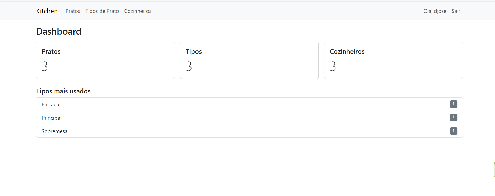
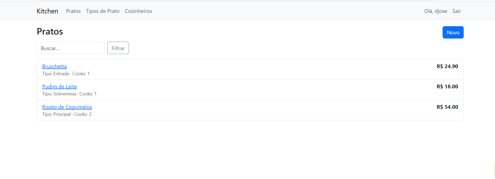
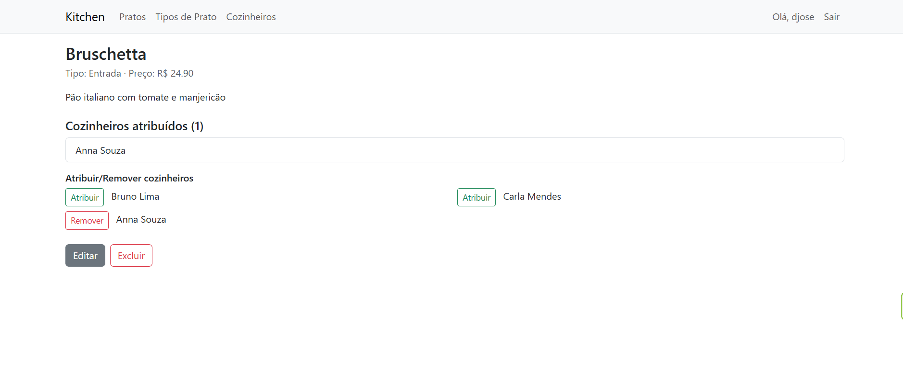
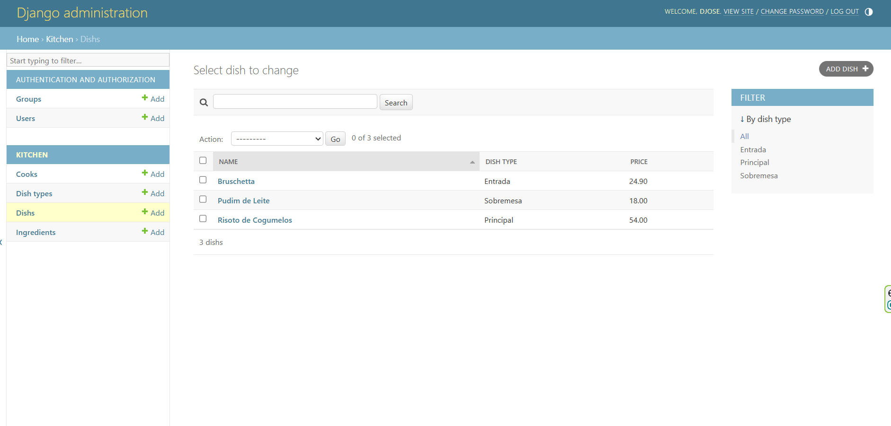
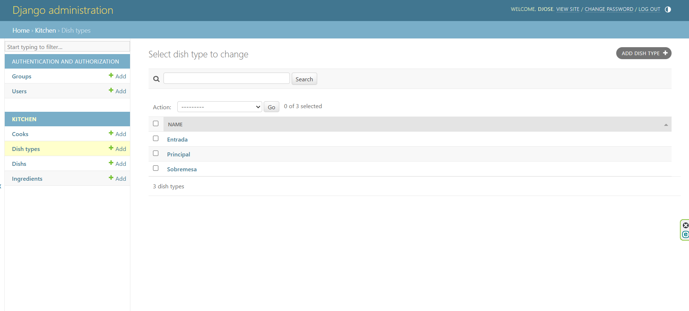

# Serviço de Cozinha de Restaurante (Django)

Projeto final baseado no modelo Taxi Service. CRUD de **Pratos (Dish)**, **Tipos de Prato (DishType)** e **Cozinheiros (Cook)**, com **atribuição/remover cozinheiros** no detalhe do prato, **busca (?q=)** e **paginação**.

## Stack
- Python 3.13
- Django 4.2 LTS
- SQLite (dev)
- Bootstrap via CDN
- flake8

## Como rodar
```bash
python -m venv .venv
. .venv/Scripts/activate  # Windows
pip install -r requirements.txt  # se existir; caso contrário: pip install "Django==4.2.*" flake8
python manage.py migrate
python manage.py runserver

## Screenshots
Aplicação:




Admin:



